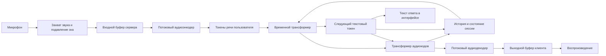

# aether — архитектура голосовой модели

Статус: проектная спецификация, версия 0.1.
Дата: 2026-09-16.

Этот документ описывает целевое устройство aether. Реализация, обученные веса и результаты измерений в репозитории пока отсутствуют. Численные значения ниже служат исходной конфигурацией или критериями проверки, а не заявлением о достигнутом качестве. Обязательный стек — Python 3.12 и uv; сервер, модель, обучение, оценка и локальный клиент реализуются на Python. Полная навигация по спецификации находится в [README](README.md).

## 1. Цель

Организация выполнения: текущая машина — разработка и ограниченные тесты без обучения; обучение и полномасштабные проверки — удалённый runtime платного Google Colab через notebook. План реализации и статусы находятся в [tasks.md](tasks.md). Указания на обучение и GPU-измерения ниже всегда относятся к этой удалённой среде.

aether — голосовая система, которая непрерывно воспринимает речь пользователя и одновременно может формировать собственную речь. Первая задача команды — получить естественный разговор: небольшой интервал перед ответом, возможность перебить систему, короткие подтверждения, корректную обработку пауз и устойчивый голос.

Развитие разделяется на две проверяемые цели:

1. Воспроизвести динамику живого голосового общения.
2. Повысить содержательность ответов, следование инструкциям и способность решать задачи, сохранив эту динамику.

Самостоятельный интерфейс и сервер ещё не означают создание самостоятельной обученной модели. Для голосовых способностей нужны совместимые обученные компоненты и диалоговые данные. Повторение структуры нейросети со случайными весами не даст работающего собеседника.

## 2. Границы первой версии

Первый исследовательский прототип обслуживает один разговор на одном вычислительном worker. Первый живой клиент — локальное Python-приложение с микрофоном и наушниками. Браузерный клиент — последующий необязательный адаптер; ему потребуется небольшой слой JavaScript для браузерных аудио API. Сервер выполняет нейросетевые вычисления. Вход и выход — монофоническое потоковое аудио.

В первую версию входят:

- одновременные приём микрофона и воспроизведение ответа;
- потоковое кодирование и декодирование звука;
- совместная модель текста и двух аудиопотоков;
- изолированное состояние разговора;
- измерение задержки, устойчивости и качества;
- воспроизводимый набор диалоговых испытаний.

Долговременная память, выполнение внешних действий, изменение голоса и массовое обслуживание пользователей — последующие этапы. Русский язык является отдельной целью обучения и оценки: его нельзя считать поддержанным только потому, что текстовый токенизатор способен кодировать кириллицу.

## 3. Общая схема



Приём и воспроизведение идут независимо. Пока система говорит, входной поток продолжает обновлять её состояние. Отсутствие речи также является частью временной последовательности: тишину нельзя просто вырезать без изменения поведения модели.

## 4. Представление аудио

Исходный контракт прототипа:

| Параметр | Проектное значение |
|---|---|
| Аудио внутри модельного контура | PCM, mono, 24 000 Гц |
| Частота модельных кадров | 12,5 Гц |
| Длительность кадра | 80 мс |
| Отсчётов в кадре | 1 920 |
| Активных аудиокодов на поток и кадр | 8 |
| Размер словаря одного аудиокода | 2 048 |
| Аудиопотоки | Пользователь и aether |
| Дополнительный поток | Текст собственной речи aether |

Это согласованный стартовый контракт. Его необходимо сверить с выбранными весами до реализации загрузчика. Количество кодовых книг, размер словарей и порядок потоков нельзя менять независимо от модели.

Восьми кодам с 2 048 значениями требуется теоретически 88 бит на кадр. При 12,5 кадрах в секунду это 1 100 бит/с на один поток без транспортных накладных расходов. Этот расчёт относится к дискретному представлению внутри модели, а не к реальному сетевому битрейту браузера.

### 4.1. Аудиокодек

Энкодер преобразует непрерывную волну в компактные признаки. Квантователь заменяет их дискретными индексами кодовых книг. Декодер восстанавливает звуковую волну из последовательности индексов.

Целевая структура:

```text
PCM → каузальный энкодер → временные признаки
    → понижение частоты признаков → квантователь → аудиокоды

аудиокоды → восстановление признаков → повышение частоты
          → каузальный декодер → PCM
```

Каузальность означает отсутствие зависимости от ещё не поступившего звука. Между вызовами сохраняются состояния свёрток и внимания. Каждый кадр продолжает предыдущие; отдельное кодирование кадров со сбросом состояния создаст разрывы.

Полезно разделить роли кодов: первый должен хорошо передавать содержание речи, остальные — уточнять акустику. Для обучения такого представления можно использовать семантического учителя и отдельную цель восстановления звука. Выбор учителя и функций потерь — самостоятельный эксперимент.

Качество кодека проверяется отдельно от диалоговой модели: через разборчивость восстановленной речи, устойчивость тембра, согласные, паузы, шумы и непрерывность на границах кадров.

### 4.2. Два независимых аудиопотока

Пользователь и aether занимают разные группы кодовых каналов на общей временной оси. Их речь может пересекаться. Смешивание обоих голосов в один канал уничтожает явное разделение ролей и усложняет обучение перебиваниям.

Во время интерактивного вывода пользовательские коды поступают от микрофона, а собственные коды генерирует модель. Во время обучения доступны записанные целевые последовательности. Состав предсказываемых каналов и маски потерь должны быть явно указаны в конфигурации эксперимента.

## 5. Совместная модель текста и речи

### 5.1. Временной трансформер

Крупная авторегрессионная сеть обрабатывает развитие разговора по времени. Вход одного шага собирается из эмбеддингов текстового и аудиоканалов с учётом их задержек. История хранится в KV-кэше внимания.

Для первоначальной конфигурации рассматриваются 32 слоя, размер скрытого состояния 4 096 и 32 головы внимания. Это исследовательская отправная точка; окончательный размер зависит от выбранной инициализации, оборудования и бюджета обучения.

Сеть делает один временной шаг на аудиокадр. Несколько аудиокодов внутри кадра не должны превращаться в столько же отдельных шагов крупной сети: иначе стоимость и задержка резко вырастут.

### 5.2. Текстовый поток

Из временного состояния формируется распределение следующего текстового токена. Текст представляет содержание произносимого ответа и помогает направлять генерацию аудио.

Это не отдельный неограниченный процесс рассуждения. Нельзя предполагать, что модель успевает выполнить сложное планирование за один аудиокадр.

Частота появления слов не совпадает с частотой кадров. Для выравнивания нужны специальные позиции заполнения и правила размещения токенов относительно звука. Их необходимо сохранять одинаковыми в подготовке данных, обучении и выводе.

Отображаемый текст ответа не является транскриптом пользователя. Если для оценки или будущих инструментов потребуется распознавание пользовательской речи, оно добавляется отдельным диагностическим либо функциональным компонентом.

### 5.3. Трансформер аудиокодов

Меньшая сеть последовательно предсказывает аудиокоды внутри модельного шага. Она получает временное состояние, текстовый токен и ранее выбранные коды этого шага.

Стартовая конфигурация: 6 слоёв, скрытое состояние 1 024, 16 голов внимания. Состояние этой сети обслуживает внутренний цикл генерации кодов и не заменяет долговременный KV-кэш временного трансформера.

Разделение вычислений позволяет крупной сети отвечать за контекст, а меньшей — за детализацию аудиопредставления.

### 5.4. Задержки каналов

Смысловые и акустические коды могут иметь разные смещения по времени. Задержка акустических уточнений на один кадр даёт генератору дополнительный контекст, но увеличивает минимальную алгоритмическую задержку.

Из-за смещений коды, рассчитанные в одном шаге сети, не обязательно относятся к одному физическому аудиокадру. Перед декодированием их необходимо собрать обратно по временным индексам.

Реализация должна явно задавать:

- порядок каналов;
- задержку каждого канала;
- начальные и заполняющие токены;
- маски недействительных позиций;
- условия появления первого полного выходного кадра;
- правила завершения и сброса последовательности.

Ошибки выравнивания могут давать звук правильной формы тензора, но с неверным содержанием. Проверка только размерностей недостаточна.

## 6. Потоковый цикл выполнения

Ниже приведён концептуальный алгоритм, а не готовая реализация API:

```text
создать состояние сессии
инициализировать состояния кодека, генератора и транспорта

пока сессия активна:
    принять очередные аудиоданные
    преобразовать их к внутреннему формату
    накопить полный входной кадр
    закодировать его с сохранением истории кодека
    передать пользовательские коды в генератор
    выполнить временной шаг и генерацию выходных кодов
    восстановить выравнивание выходных каналов
    если готов полный выходной кадр:
        декодировать его с сохранением истории
        отправить звук клиенту
    отправить новые отображаемые текстовые токены
    записать длительности этапов и размер очередей

при завершении освободить состояние сессии
```

Конкретный генератор должен сам владеть расписанием задержек. Приложение не должно второй раз вручную сдвигать уже выровненный результат.

### 6.1. Состояние сессии

Каждой сессии принадлежат входной остаток PCM, состояния энкодера и декодера, KV-кэш, буфер задержанных кодов, состояние генератора случайных чисел, счётчики кадров и выходные очереди.

Веса модели могут быть общими для нескольких сессий. Их изменяемые состояния — нет. Начало нового разговора должно сбрасывать все компоненты согласованно, иначе возможны перенос контекста и акустические артефакты.

### 6.2. Реальное время и перегрузка

На один кадр приходится 80 мс входящего звука. Среднее время обработки должно быть меньше этого интервала с запасом; также необходимо контролировать редкие медленные шаги.

Очереди должны быть ограничены. При перегрузке сначала прекращается приём новых сессий. Длительное накопление аудио в очереди превращает живой разговор в воспроизведение прошлого.

Произвольное удаление кадров из модельной истории нарушает её временную структуру. Политика пропусков, восстановления соединения и сброса должна быть отдельной проверяемой частью протокола.

## 7. Голосовое поведение

Full-duplex означает, что вход продолжает обрабатываться во время выхода. Сам по себе двусторонний сокет ещё не обеспечивает умение корректно уступать слово.

Модель должна научиться различать:

- завершённый вопрос и паузу внутри предложения;
- короткое подтверждение и попытку перебить;
- исправление пользователем своих слов;
- обращение к системе и фоновую речь;
- уместную тишину и необходимость ответить.

Можно добавить принудительное прекращение воспроизведения по явной команде пользователя. Такой механизм следует оценивать отдельно от обученного поведения. Простое выключение динамика не отменяет уже сгенерированные токены в истории; необходима политика согласования слышимого ответа и внутреннего состояния.

## 8. Клиент и сервер

### 8.1. Браузерный клиент

Клиент отвечает за разрешение микрофона, захват звука, подавление эха, преобразование частоты, отправку небольших пакетов и непрерывное воспроизведение. Передача звука не останавливается на время ответа.

Размер сетевого пакета может отличаться от модельного кадра. Буфер сервера собирает из пакетов точные кадры. Для удалённого доступа нужен защищённый контекст браузера.

Начальную оценку проводить в наушниках, затем повторять на динамиках. Это помогает отделить ошибки модели от обратной акустической связи.

### 8.2. Транспорт

Для первой версии предлагается WebSocket с двоичными аудиосообщениями. PCM упрощает диагностику, транспортный аудиокодек уменьшает трафик. Выбор фиксируется экспериментом по задержке и качеству; нейросетевые аудиотокены и сетевое сжатие — разные уровни.

События протокола aether:

| Событие | Назначение |
|---|---|
| `session.start` | Согласование версии и аудиоформата |
| `session.ready` | Подтверждение готовности прогретого worker |
| `audio.input` | Пакет микрофона с порядковым номером |
| `audio.output` | Пакет ответа с порядковым номером |
| `text.output` | Фрагмент текста собственной речи |
| `session.stop` | Завершение разговора |
| `session.error` | Ошибка с машинным кодом причины |

Это предлагаемый контракт aether, который ещё предстоит реализовать. Метки времени разных устройств нельзя напрямую вычитать без синхронизации часов.

### 8.3. Разделение сервисов

Первоначально достаточно клиента, сервера сессий и одного inference worker. Отдельный сервис хранения записей добавляется только для согласованного сбора данных и оценки.

Масштабирование выполняется после измерения одной сессии. Ограничения определяются одновременно памятью, временем кадра и очередями. Динамический batching допустим только при сохранении временных сроков и изоляции состояний.

## 9. Обучение и данные

### 9.1. Инициализация

Практический путь — начать с совместимых предварительно обученных компонентов и получить измеримый базовый результат. Обучение всей системы с нуля является отдельной программой с существенно большим бюджетом данных и вычислений.

Текстовую сеть нельзя заменить произвольной более сильной LLM без адаптации. Размерности, словарь, эмбеддинги, распределение скрытых состояний и связи с аудиогенератором должны быть согласованы.

### 9.2. Этапы обучения собственной модели

Предлагаемая последовательность:

1. Проверить качество текстовой основы на задачах целевого языка.
2. Получить или обучить потоковый аудиокодек.
3. Обучить согласование текста и аудио на выровненных данных.
4. Обучить совместную обработку двух аудиопотоков.
5. Дообучить на естественных диалогах с паузами и пересечениями речи.
6. Добавить инструкционные диалоги и целевое поведение помощника.
7. Выполнять направленные улучшения по ошибкам независимого набора оценки.

Сохранение текстовых способностей необходимо проверять после каждого существенного этапа. Улучшение звучания не гарантирует улучшения ответов.

### 9.3. Контракт диалоговых данных

Для каждого примера нужны два синхронных канала с фиксированными ролями, временные границы, транскрипты, язык, происхождение записи и условия использования.

Сохраняются паузы, перебивания, короткие междометия и одновременная речь. Нельзя превращать обучающую выборку только в аккуратные последовательности «вопрос — ответ» и ожидать естественного поведения при наложении голосов.

Разделение train, validation и test выполняется по разговорам и участникам, а не по соседним фрагментам одной записи. Синтетические и реальные данные учитываются отдельно. Независимый тестовый набор не используется для выбора обучающих примеров.

### 9.4. Функции потерь

Исходная цель диалоговой модели — взвешенная сумма cross-entropy для текста и предсказываемых аудиокодов. Вес текста, смыслового аудиокода, акустических уточнений и заполнения выбирается экспериментально.

Начальные, отсутствующие и невыравненные позиции маскируются. Метрики каждого компонента ведутся отдельно: общий loss способен скрыть ухудшение текста на фоне улучшения акустики.

Дообучение адаптерами подходит для первых контролируемых экспериментов, но не гарантирует освоение нового языка или сложного рассуждения. Для каждого опыта сохраняются базовые веса, параметры адаптера, состав данных и полный результат оценки.

## 10. Повышение качества ответов

Оценку «слабый собеседник» необходимо разложить на измеримые причины: неверное понимание аудио, потеря контекста, незнание факта, логическая ошибка, игнорирование инструкции или преждевременный ответ.

Предлагаются три направления:

| Направление | Возможная польза | Основной риск |
|---|---|---|
| Качественные диалоги и направленное дообучение | Улучшение полезности при сохранении структуры | Переобучение и ухудшение голосового поведения |
| Более сильная текстовая основа с мультимодальным обучением | Повышение предела содержательных способностей | Высокая стоимость и несовместимость готовых весов |
| Внешний планировщик для сложных задач | Доступ к инструментам и более длительным вычислениям | Задержка и рассогласование плана с уже произнесённым |

Для первого этапа выбирается воспроизводимая единая голосовая модель. Внешний планировщик добавляется только после получения базовых измерений. Для него потребуется обученный или явно реализованный интерфейс управления речью; наличие текстового потока само по себе таким интерфейсом не является.

## 11. Измерения и критерии готовности

### 11.1. Разделение задержек

Измерять отдельно:

- ожидание полного входного кадра;
- передачу и очереди;
- кодирование, генерацию и декодирование;
- заполнение выходного буфера;
- время до фактического воспроизведения;
- поведенческий интервал между завершением вопроса и началом ответа.

При кадре 80 мс и дополнительном смещении на один кадр номинальный алгоритмический бюджет составляет 160 мс до остальных расходов. Это не обещание времени ответа: модель может намеренно молчать, а вычисления и сеть добавляют задержку.

### 11.2. Первоначальные инженерные ориентиры

Все пороги ниже предложены для локального стенда с одним пользователем и требуют пересмотра после первого измерения.

| Метрика | Начальный ориентир |
|---|---|
| Время полного вычислительного шага | p95 < 80 мс |
| Транспортно-вычислительная задержка готового аудио | p50 ≤ 300 мс, p95 ≤ 500 мс |
| Рост очереди в пределах тестовой сессии | Отсутствует устойчивое накопление |
| Изоляция повторных подключений | Отсутствуют звук и контекст прошлой сессии |
| Поддерживаемая длительность | Явно измерена и указана для конфигурации |
| Перебивание | Измеряются время уступки и корректность следующей реплики |

Время уступки отсчитывается от начала явной попытки перебить до прекращения слышимой речи. Короткие подтверждения проверяются отдельным классом, чтобы система не считалась хорошей лишь потому, что замолкает при любом звуке.

### 11.3. Набор оценки

Подготовить не менее 100 сценариев: короткие вопросы, инструкции с ограничениями, исправления, паузы внутри фразы, перебивания, подтверждения, тишина, шум, числа и имена, длинные разговоры и повторные подключения.

Для каждого сценария фиксируются ожидаемые признаки поведения, аудио, текст ответа, конфигурация, seed и временные метрики. Стохастические сценарии повторяются с несколькими seed. Качество смысла и голоса оценивается раздельно, с ручной проверкой части записей.

## 12. План реализации

### Этап A. Базовый исследовательский стенд

Выбрать оборудование, язык первой проверки и совместимый комплект весов. Зафиксировать версии и контрольные суммы. Проверить кодек отдельно, затем потоковую генерацию на заранее записанном входе.

Результат: воспроизводимый аудиодиалог и профиль потребления памяти без браузерных факторов.

### Этап B. Живой разговор

Добавить Python-клиент, транспорт, отдельное состояние сессии, прогрев и измерение очередей. Проверить наушники, паузы, перебивания и переподключение. Браузер и работу с динамиками проверять после реализации подавления эха.

Результат: работающий голосовой прототип с известными ограничениями и сохранённым базовым набором результатов.

### Этап C. Контролируемое улучшение

Собрать ошибки, подготовить небольшой проверенный набор данных и провести первое дообучение. Сравнить с базовым результатом при одинаковых условиях.

Результат: улучшение выбранной категории ответов без неприемлемого ухудшения задержки, тембра и диалоговой динамики.

### Этап D. Развитие модели

Исследовать целевой язык, более сильную текстовую основу, расширенный контекст и интерфейс планировщика. Каждое направление вести отдельным экспериментом с собственным критерием успеха.

## 13. Предлагаемая структура реализации

```text
aether/
├── docs/                # Полная документация
├── pyproject.toml       # Метаданные и зависимости Python
├── uv.lock              # Зафиксированное разрешение зависимостей
├── .python-version      # Версия Python
├── configs/             # Контракты моделей и экспериментов
├── src/aether/
│   ├── audio/           # Захват, ресемплинг и буферы
│   ├── model/           # Кодек и трансформеры
│   ├── inference/       # Генератор и состояние сессии
│   ├── server/          # Протокол и управление соединениями
│   ├── client/          # Локальный Python-клиент
│   ├── training/        # Подготовка данных и обучение
│   └── evaluation/      # Сценарии, метрики и сравнение запусков
└── tests/               # Выравнивание, изоляция и потоковые проверки
```

Это целевая структура. Созданы документация, каркас Python-пакета с CLI, uv-окружение, синтетическая конфигурация и первые интеграционные тесты. Модельные модули пока не реализованы. Большие веса, сырые записи и обучающие наборы хранятся вне Git. Правила Python-проекта определены в [development.md](development.md).

## 14. Решения, которые необходимо принять

- Какой язык является обязательным для первого демонстрационного результата?
- На каком оборудовании измеряется задержка?
- Какова допустимая длительность разговора и политика обновления контекста?
- Какой бюджет доступен для получения весов, данных и обучения?
- Какие компоненты берутся готовыми, а какие команда обучает самостоятельно?
- Какие содержательные задачи определяют успешность aether?

Начальный критерий успеха: aether ведёт измеримо устойчивый разговор в реальном времени, продолжает слушать во время ответа и корректно реагирует на изменение реплики пользователя. Дальнейшее повышение интеллекта оценивается относительно этого сохранённого базового результата.
