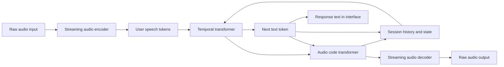

# aether — voice model architecture

Status: design specification, version 0.1.
Date: 2026-09-16.

This document describes the target design of aether. The implementation, trained weights, and measurement results are not yet present in the repository. The numerical values below serve as an initial configuration or verification criteria, not a claim of achieved quality. The required stack is Python 3.12 and uv; the model, training, and evaluation are implemented in Python. Full navigation of the specification is in [README](README.md).

## 1. Purpose

Execution setup: the current machine is used for development and limited tests without training; training and full-scale checks run on the remote runtime of paid Google Colab via a notebook. The implementation plan and statuses are in [tasks.md](tasks.md). References to training and GPU measurements below always refer to this remote environment.

aether is a voice system that continuously perceives the user's speech while simultaneously being able to produce its own speech. The team's first task is to achieve a natural conversation: a short interval before responding, the ability to interrupt the system, brief acknowledgments, correct handling of pauses, and a stable voice.

Development is split into two verifiable goals:

1. Reproducing the dynamics of live voice conversation.
2. Increasing the substantiveness of responses, instruction-following, and problem-solving ability, while preserving this dynamic.

A self-contained interface by itself does not amount to a self-contained trained model. Voice capabilities require compatible trained components and dialogue data. Replicating the neural network's structure with random weights will not produce a working conversational partner.

## 2. Boundaries of the first version

The first research prototype serves one conversation on one compute worker. Input and output are streamed mono audio.

The first version includes:

- simultaneous microphone input and response playback;
- streaming audio encoding and decoding;
- a joint model of text and two audio streams;
- isolated conversation state;
- measurement of latency, stability, and quality;
- a reproducible set of dialogue trials.

Long-term memory, execution of external actions, voice modification, and serving users at scale are subsequent stages. Russian is a separate training and evaluation goal: it cannot be considered supported merely because the text tokenizer is able to encode Cyrillic.

## 3. Overall diagram



Reception and playback proceed independently. While the system is speaking, the input stream continues to update its state. The absence of speech is also part of the temporal sequence: silence cannot simply be cut out without changing the model's behavior.

## 4. Audio representation

Initial prototype contract:

| Parameter | Design value |
|---|---|
| Audio inside the model loop | PCM, mono, 24,000 Hz |
| Model frame rate | 12.5 Hz |
| Frame duration | 80 ms |
| Samples per frame | 1,920 |
| Active audio codes per stream per frame | 8 |
| Vocabulary size of one audio code | 2,048 |
| Audio streams | User and aether |
| Additional stream | Text of aether's own speech |

This is an agreed starting contract. It needs to be checked against the chosen weights before the loader is implemented. The number of codebooks, vocabulary sizes, and stream order cannot be changed independently of the model.

Eight codes with 2,048 values theoretically require 88 bits per frame. At 12.5 frames per second, this is 1,100 bits/s for a single stream without transport overhead. This calculation refers to the discrete representation inside the model, not to the actual network bitrate of a browser.

### 4.1. Audio codec

The encoder converts the continuous waveform into compact features. The quantizer replaces them with discrete codebook indices. The decoder reconstructs the audio waveform from the sequence of indices.

Target structure:

```text
PCM → causal encoder → temporal features
    → feature downsampling → quantizer → audio codes

audio codes → feature reconstruction → upsampling
          → causal decoder → PCM
```

Causality means there is no dependence on audio that has not yet arrived. Convolution and attention states are preserved between calls. Each frame continues the previous ones; encoding frames separately with a state reset would create discontinuities.

It is useful to separate the roles of the codes: the first should convey the content of speech well, while the rest refine the acoustics. Training such a representation can use a semantic teacher along with a separate audio-reconstruction objective. The choice of teacher and loss functions is a separate experiment.

Codec quality is verified separately from the dialogue model: through the intelligibility of reconstructed speech, timbre stability, consonants, pauses, noise, and continuity across frame boundaries.

### 4.2. Two independent audio streams

The user and aether occupy different groups of code channels on a shared time axis. Their speech can overlap. Mixing both voices into a single channel destroys the explicit separation of roles and makes training for interruptions harder.

During interactive inference, the user's codes come from the microphone, while the model generates its own codes. During training, recorded target sequences are available. The set of predicted channels and the loss masks must be explicitly specified in the experiment configuration.

## 5. Joint model of text and speech

### 5.1. Temporal transformer

A large autoregressive network processes the evolution of the conversation over time. The input for a single step is assembled from the embeddings of the text and audio channels, accounting for their delays. History is stored in the attention KV cache.

For the initial configuration, 32 layers, a hidden state size of 4,096, and 32 attention heads are under consideration. This is a research starting point; the final size depends on the chosen initialization, hardware, and training budget.

The network takes one temporal step per audio frame. Multiple audio codes within a frame must not turn into an equal number of separate steps of the large network: otherwise cost and latency would rise sharply.

### 5.2. Text stream

The distribution of the next text token is formed from the temporal state. The text represents the content of the spoken response and helps guide audio generation.

This is not a separate, unbounded reasoning process. It cannot be assumed that the model manages to perform complex planning within a single audio frame.

The rate at which words appear does not match the frame rate. Alignment requires special filler positions and rules for placing tokens relative to the audio. These must be kept consistent across data preparation, training, and inference.

The displayed response text is not a transcript of the user. If recognition of the user's speech is needed for evaluation or future tools, it is added as a separate diagnostic or functional component.

### 5.3. Audio code transformer

A smaller network sequentially predicts the audio codes within a model step. It receives the temporal state, the text token, and the codes already chosen at this step.

Starting configuration: 6 layers, a hidden state of 1,024, and 16 attention heads. This network's state serves the inner code-generation loop and does not replace the temporal transformer's long-term KV cache.

This division of computation lets the large network handle context while the smaller one handles the detail of the audio representation.

### 5.4. Channel delays

Semantic and acoustic codes can have different time offsets. Delaying the acoustic refinements by one frame gives the generator additional context but increases the minimum algorithmic latency.

Because of these offsets, codes computed within a single network step do not necessarily belong to the same physical audio frame. Before decoding, they must be reassembled according to their time indices.

The implementation must explicitly specify:

- the order of channels;
- the delay of each channel;
- the initial and filler tokens;
- masks for invalid positions;
- the conditions for the appearance of the first complete output frame;
- the rules for terminating and resetting the sequence.

Alignment errors can produce audio with the correct tensor shape but incorrect content. Checking dimensions alone is not sufficient.

## 6. Streaming execution loop

Below is a conceptual algorithm, not a ready-made API implementation:

```text
create the session state
initialize the codec, generator, and transport states

while the session is active:
    receive the next audio chunk
    convert it to the internal format
    accumulate a complete input frame
    encode it while preserving codec history
    pass the user codes to the generator
    perform a temporal step and generate output codes
    restore alignment of the output channels
    if a complete output frame is ready:
        decode it while preserving history
        queue the audio for output
    emit new displayable text tokens
    log stage durations and queue sizes

on termination, release the session state
```

The concrete generator is responsible for owning the delay schedule itself. The application must not manually shift an already-aligned result a second time.

### 6.1. Session state

Each session owns a leftover PCM buffer, the encoder and decoder states, the KV cache, a buffer of delayed codes, the random number generator state, frame counters, and output queues.

Model weights can be shared across several sessions. Their mutable states cannot. Starting a new conversation must reset all components consistently, otherwise context leakage and acoustic artifacts are possible.

### 6.2. Real time and overload

Each frame corresponds to 80 ms of incoming audio. Average processing time must be below this interval with margin; rare slow steps must also be monitored.

Queues must be bounded. Under overload, accepting new sessions is stopped first. Prolonged accumulation of audio in a queue turns a live conversation into playback of the past.

Arbitrarily dropping frames from the model's history disrupts its temporal structure. The policy for drops, reconnection, and reset must be a separate, verifiable part of the protocol.

## 7. Voice behavior

Full-duplex means that input continues to be processed during output. A bidirectional socket by itself does not provide the ability to correctly yield the floor.

The model must learn to distinguish between:

- a completed question and a pause within a sentence;
- a short acknowledgment and an attempt to interrupt;
- the user correcting their own words;
- speech addressed to the system and background speech;
- appropriate silence and the need to respond.

A forced stop of playback triggered by an explicit user command can be added. Such a mechanism should be evaluated separately from the learned behavior. Simply turning off the speaker does not cancel the tokens already generated in the history; a policy is needed to reconcile the audible response with the internal state.

## 9. Training and data

### 9.1. Initialization

The practical path is to start from compatible pretrained components and obtain a measurable baseline result. Training the entire system from scratch is a separate program requiring a substantially larger budget of data and compute.

The text network cannot be replaced with an arbitrary, stronger LLM without adaptation. Dimensions, vocabulary, embeddings, the distribution of hidden states, and the connections to the audio generator must be aligned.

### 9.2. Stages of training the model

The proposed sequence:

1. Verifying the quality of the text foundation on tasks in the target language.
2. Obtaining or training a streaming audio codec.
3. Training text-audio alignment on aligned data.
4. Training joint processing of the two audio streams.
5. Fine-tuning on natural dialogues with pauses and overlapping speech.
6. Adding instructional dialogues and target assistant behavior.
7. Carrying out targeted improvements based on errors from an independent evaluation set.

Retention of text capabilities needs to be checked after every substantial stage. Improved sound quality does not guarantee improved responses.

### 9.3. Dialogue data contract

Each example requires two synchronized channels with fixed roles, time boundaries, transcripts, language, recording provenance, and usage terms.

Pauses, interruptions, short interjections, and overlapping speech are preserved. The training set cannot be reduced to tidy question-answer sequences alone while still expecting natural behavior under voice overlap.

The train/validation/test split is done by conversations and participants, not by adjacent fragments of the same recording. Synthetic and real data are tracked separately. The independent test set is not used to select training examples.

### 9.4. Loss functions

The initial objective of the dialogue model is a weighted sum of cross-entropy for the text and the predicted audio codes. The weight of the text, the semantic audio code, the acoustic refinements, and the filler tokens is chosen experimentally.

Initial, missing, and misaligned positions are masked. Metrics for each component are tracked separately: the overall loss can mask a degradation in text quality behind an improvement in acoustics.

Adapter-based fine-tuning is suitable for the first controlled experiments but does not guarantee mastery of a new language or complex reasoning. For each experiment, the base weights, adapter parameters, data composition, and full evaluation result are retained.

## 10. Improving response quality

The assessment of a "weak conversational partner" needs to be broken down into measurable causes: misunderstanding the audio, loss of context, lack of factual knowledge, logical error, ignoring an instruction, or a premature response.

Three directions are proposed:

| Direction | Possible benefit | Main risk |
|---|---|---|
| High-quality dialogues and targeted fine-tuning | Improved usefulness while preserving structure | Overfitting and degraded voice behavior |
| A stronger text foundation with multimodal training | Raising the ceiling of substantive ability | High cost and incompatibility with off-the-shelf weights |
| An external planner for complex tasks | Access to tools and longer computation | Latency and mismatch between the plan and what has already been spoken |

For the first stage, a reproducible, unified voice model is chosen. An external planner is added only after baseline measurements have been obtained. It will require a trained or explicitly implemented speech-control interface; the mere presence of a text stream does not by itself constitute such an interface.

## 11. Measurements and readiness criteria

### 11.1. Breakdown of latency

Measured separately:

- waiting for a complete input frame;
- transmission and queuing;
- encoding, generation, and decoding;
- filling the output buffer;
- time to actual playback;
- the behavioral interval between the end of a question and the start of the response.

With an 80 ms frame and an additional one-frame offset, the nominal algorithmic budget is 160 ms before other costs. This is not a promise about response time: the model may deliberately remain silent, and computation and network add further latency.

### 11.2. Initial engineering benchmarks

All the thresholds below are proposed for a local single-user bench and require revision after the first measurement.

| Metric | Initial benchmark |
|---|---|
| Full compute step time | p95 < 80 ms |
| Transport-and-compute latency for ready audio | p50 ≤ 300 ms, p95 ≤ 500 ms |
| Queue growth within a test session | No sustained accumulation |
| Isolation across reconnections | No audio or context from the previous session |
| Supported duration | Explicitly measured and stated for the configuration |
| Interruption | Time to yield and correctness of the next reply are measured |

Time-to-yield is measured from the start of an explicit attempt to interrupt to the point where audible speech stops. Short acknowledgments are checked as a separate class, so that the system is not judged good merely because it falls silent at any sound.

### 11.3. Evaluation set

At least 100 scenarios are prepared: short questions, instructions with constraints, corrections, mid-phrase pauses, interruptions, acknowledgments, silence, noise, numbers and names, long conversations, and reconnections.

For each scenario, the expected behavioral markers, audio, response text, configuration, seed, and timing metrics are recorded. Stochastic scenarios are repeated with several seeds. The quality of meaning and of voice is evaluated separately, with manual review of a portion of the recordings.

## 12. Implementation plan

### Stage A. Basic research bench

This stage selects the hardware, the language for the first check, and a compatible set of weights. Versions and checksums are fixed. The codec is verified separately, followed by streaming generation on a pre-recorded input.

Result: a reproducible audio dialogue and a memory consumption profile without browser factors.

### Stage B. Controlled improvement

This stage collects errors, prepares a small curated dataset, and carries out the first fine-tuning round. The result is compared with the baseline under identical conditions.

Result: improvement in the selected category of responses without unacceptable degradation of latency, timbre, or dialogue dynamics.

### Stage C. Model development

This stage explores the target language, a stronger text foundation, extended context, and a planner interface. Each direction is pursued as a separate experiment with its own success criterion.

## 13. Proposed implementation structure

```text
aether/
├── docs/                # Full documentation
├── pyproject.toml       # Python metadata and dependencies
├── uv.lock              # Locked dependency resolution
├── .python-version      # Python version
├── configs/             # Model and experiment contracts
├── src/aether/
│   ├── audio/           # Capture, resampling, and buffers
│   ├── model/           # Codec and transformers
│   ├── inference/       # Generator and session state
│   ├── training/        # Data preparation and training
│   └── evaluation/      # Scenarios, metrics, and run comparison
└── tests/               # Alignment, isolation, and streaming checks
```

This is the target structure. The documentation, a Python package skeleton with a CLI, the uv environment, a synthetic configuration, and the first integration tests have been created. The model modules are not yet implemented. Large weights, raw recordings, and training sets are stored outside Git. Python project rules are defined in [development.md](development.md).

## 14. Decisions still to be made

- Which language is mandatory for the first demonstration result?
- On what hardware is latency measured?
- What is the acceptable conversation duration and the context-refresh policy?
- What budget is available for obtaining weights, data, and training?
- Which components are taken off the shelf, and which does the team train itself?
- Which substantive tasks define the success of aether?

Initial success criterion: aether carries on a measurably stable real-time conversation, keeps listening while it is responding, and reacts correctly when the user changes what they are saying. Further increases in intelligence are evaluated relative to this preserved baseline result.
