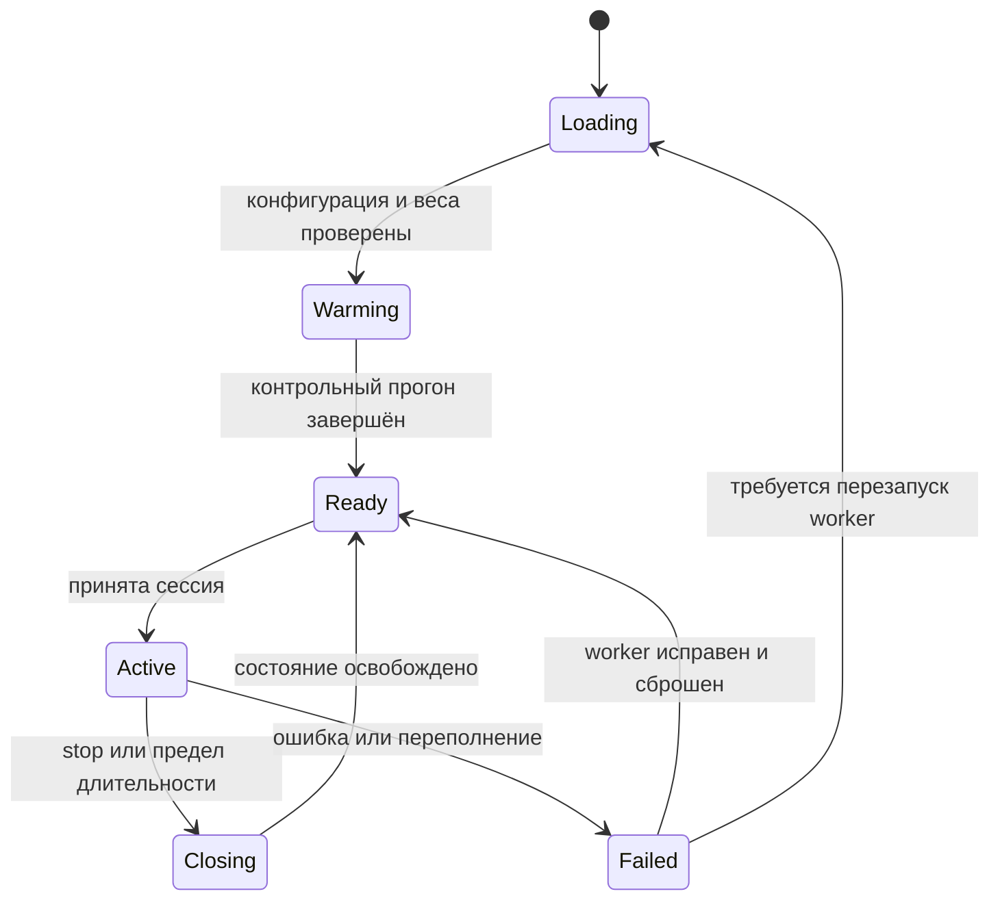

# aether — выполнение и протокол

## 1. Жизненный цикл



На первой версии worker принимает одну сессию. Вторая получает `BUSY`, а не ждёт неопределённое время в аудиоочереди.

Прогрев использует отдельное состояние, которое полностью уничтожается до `Ready`. `/health/live` проверяет процесс, `/health/ready` — возможность принять разговор. Готовность недоступна при загрузке, перегрузке и неисправном worker.

## 2. Исполнение одного шага

1. Проверить формат и номер входного пакета.
2. Добавить PCM в ограниченный входной буфер.
3. При наличии 1920 отсчётов извлечь один кадр.
4. Закодировать кадр, не сбрасывая encoder state.
5. Записать наблюдаемые коды в расписание пользовательских каналов.
6. Собрать текущий вход temporal с начальными значениями для недоступных позиций.
7. Выполнить temporal forward с KV-кешем.
8. Выбрать текстовый токен.
9. Выполнить восемь внутренних шагов depth и очистить его локальный кеш.
10. Записать собственные коды и текст в буфер генерации.
11. Собрать полный выровненный выходной кадр, если он доступен.
12. Декодировать его и передать в ограниченную выходную очередь.
13. Обновить счётчики, длительности и состояние RNG.

Генератор может вернуть `None` во время заполнения задержек. Это нормальный результат инициализации, не ошибка и не инструкция сбросить сессию.

## 3. Внутренний Python API

Целевые интерфейсы:

```python
class AudioCodec:
    def encode(self, pcm, state): ...  # [B,1,N] -> [B,8,T]
    def decode(self, codes, state): ...  # [B,8,T] -> [B,1,N]


class DialogueEngine:
    def create_session(self, config): ...
    def step(self, user_codes, state): ...  # [B,8,1] -> output | None
    def close(self, state): ...
```

Это описание границ модулей, а не готовый код. Типизированные структуры результата содержат `frame_index`, аудиокоды и отображаемый текст. Явное владение state предпочтительнее неявных глобальных переключений активной сессии.

## 4. Протокол версии 1

Адрес: `/v1/session`. Соединение WebSocket. Контрольные сообщения — JSON UTF-8; аудио — двоичные сообщения. Первый прототип использует PCM float32 little-endian, mono, 24 кГц. Транспортное сжатие добавляется только с новой согласованной возможностью протокола.

Начало:

```json
{"type":"session.start","protocol":1,"audio":{"encoding":"pcm_f32le","sample_rate":24000,"channels":1},"seed":42}
```

Ответ:

```json
{"type":"session.ready","protocol":1,"session_id":"generated-id","frame_samples":1920,"max_input_packet_samples":3840,"max_duration_ms":230000}
```

Длительность 230 секунд — исходный предел прототипа с запасом относительно контекста 240 секунд, не доказанное оптимальное значение. Сервер объявляет фактический предел конфигурации.

### Двоичный пакет

| Смещение | Размер | Значение |
|---|---|---|
| 0 | 1 байт | Версия = 1 |
| 1 | 1 байт | Вид: 1 вход, 2 выход |
| 2 | 4 байта | `sequence`, uint32 little-endian |
| 6 | 8 байт | `sample_offset`, uint64 little-endian |
| 14 | 4 байта | `sample_count`, uint32 little-endian |
| 18 | `4 × sample_count` | PCM float32 little-endian |

Для каждого направления счётчики отдельные. `sample_offset` — число отсчётов от начала этого аудиопотока, не wall clock. Первый пакет имеет sequence и offset равные нулю. Размер payload обязан точно соответствовать заголовку. Пакет содержит от 1 до 3840 отсчётов; сервер собирает кадры через границы пакетов. Максимальный двоичный размер — 15378 байт.

WebSocket сохраняет порядок. Пропуск или повтор sequence означает ошибку приложения; первая версия завершает сессию с `PROTOCOL_ERROR`. Возобновление старого состояния после разрыва не поддерживается.

### Остальные события

```json
{"type":"text.output","frame_index":18,"text":"Hello"}
{"type":"session.stop"}
{"type":"session.closed","reason":"user_stop"}
{"type":"session.error","code":"OVERLOAD","message":"Audio queue limit exceeded"}
```

`frame_index` текста относится к выровненному выходу, а не обещает точную границу произнесённого слова. Клиент добавляет текст инкрементально. Максимальный размер контрольного сообщения — 16 КиБ. Неизвестные обязательные поля и версия отклоняются; секреты и внутренние traceback клиенту не отправляются.

## 5. Очереди и время

Целевые начальные ограничители полного runtime: не более 6 полных кадров во входной очереди и 6 в выходной. Реализованный `PCMBuffer` использует переданный лимит (по умолчанию 4); см. [audio.md](audio.md). Это аварийный предел 480 мс на очередь, а не нормальный целевой размер. Метрики начинают сигнализировать о росте раньше достижения лимита.

При устойчивом переполнении сессия закрывается с `OVERLOAD`. Нельзя молча удалять середину входа и продолжать выдавать измерения как будто аудио было обработано полностью.

Если capture callback перестал доставлять звук, клиент не подменяет это пользовательской тишиной. Тишина — реальные полученные нулевые либо тихие отсчёты; отсутствие данных — проблема устройства или соединения. Таймаут отсутствия аудио первой версии — 5 секунд.

PCM кадры приходят по аудиочасам. Сервер не запускает свободный цикл генерации, который обгоняет вход. Clock drift и underrun фиксируются; коррекция ресемплинга может быть добавлена после измерения.

## 6. Завершение и отказ

При `session.stop` новые входные данные не принимаются, очереди очищаются, микрофон клиента закрывается, worker освобождает состояние. Принудительно договаривать ответ не требуется.

Для offline inference разрешён отдельный режим завершения последнего кадра нулями. Количество добавленных отсчётов сохраняется в отчёте. Хвост генерации после окончания входа имеет ограниченную длительность и явно отличается от исходной записи.

| Код | Действие |
|---|---|
| `BUSY` | Отклонить новую сессию |
| `INVALID_CONFIG` | Не переводить worker в ready |
| `PROTOCOL_ERROR` | Закрыть текущее соединение |
| `AUDIO_TIMEOUT` | Завершить разговор и освободить состояние |
| `OVERLOAD` | Закрыть сессию, записать размеры очередей |
| `MODEL_ERROR` | Остановить выдачу, проверить возможность восстановления worker |
| `CONTEXT_LIMIT` | Завершить сессию без обещания сохранения памяти |

## 7. Наблюдаемость

Сохранять длительности encode, temporal, depth, decode и отправки; количество входных и выходных отсчётов; текущие очереди; p50/p95/p99 шага; underrun/overflow; GPU memory; причину закрытия.

GPU операции асинхронны. Для профилирования использовать корректные GPU timers; не принимать время постановки операции в очередь за время вычисления. Тяжёлая синхронизация каждого кадра допускается в профилирующем режиме, но не должна незаметно менять обычный режим.

Логи по умолчанию содержат идентификаторы и метрики, без сырого аудио и полного текста разговора. Сбор диагностических записей — явная опция.
