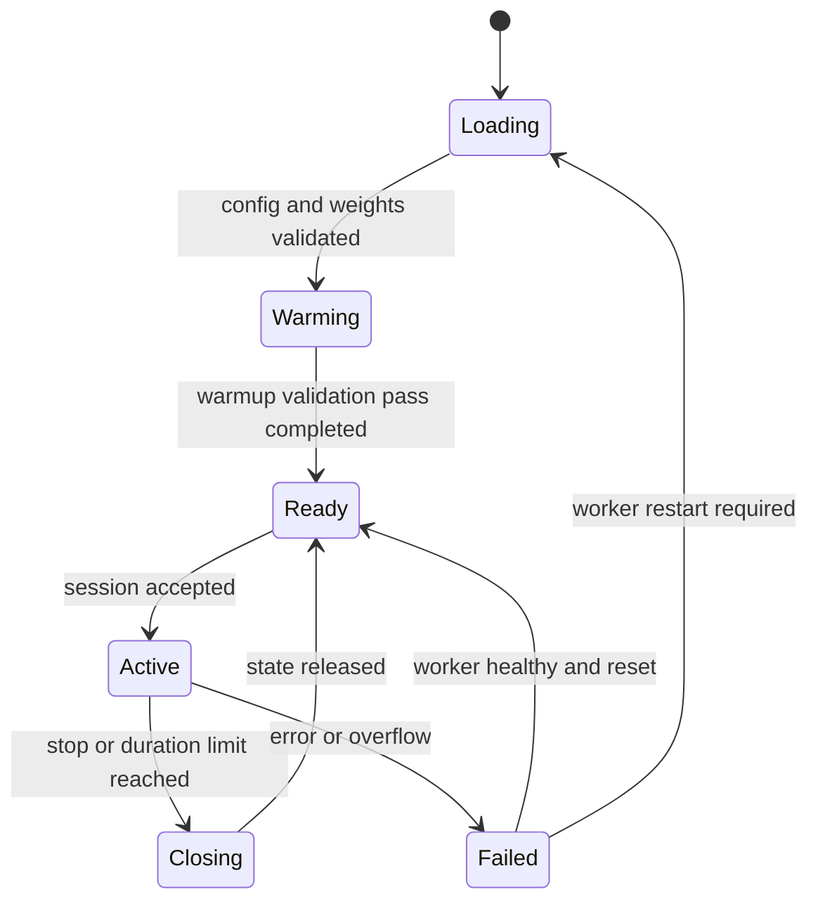

# aether — generation runtime

## 1. Lifecycle



In the current design, a worker handles a single active session at a time.

Warmup uses a dedicated state that is completely discarded before the engine reaches `Ready`. Readiness reflects whether the engine has finished loading, completed its warmup pass, and can accept a new generation session; it is unavailable while loading, while overloaded, or when the worker is in a failed state.

## 2. Single-Step Execution

1. The format and sequence number of the incoming packet are validated.
2. The PCM is appended to the bounded input buffer.
3. Once 1920 samples are available, a single frame is extracted.
4. The frame is encoded without resetting encoder state.
5. The observed codes are recorded into the user-channel schedule.
6. The current temporal input is assembled, using placeholder values for positions that are not yet available.
7. The temporal forward pass runs with the KV cache.
8. The text token is selected.
9. The eight internal depth steps run, and the depth transformer's local cache is cleared.
10. The model's own codes and text are written into the generation buffer.
11. The complete aligned output frame is assembled, once available.
12. It is decoded and pushed onto the bounded output queue.
13. Counters, durations, and RNG state are updated.

The generator can return `None` while latency buffers are filling. This is a normal outcome of initialization, not an error, and not a signal to reset the session.

## 3. Internal Python API

Target interfaces:

```python
class AudioCodec:
    def encode(self, pcm, state): ...  # [B,1,N] -> [B,8,T]
    def decode(self, codes, state): ...  # [B,8,T] -> [B,1,N]


class DialogueEngine:
    def create_session(self, config): ...
    def step(self, user_codes, state): ...  # [B,8,1] -> output | None
    def close(self, state): ...
```

This is a description of module boundaries, not ready-to-run code. The typed result structures carry `frame_index`, audio codes, and displayable text. Explicit ownership of state is preferred over implicit global switching of the active session.

## 4. Queues and Timing

Target initial limits for the full runtime: no more than 6 complete frames in the input queue and 6 in the output queue. The implemented `PCMBuffer` uses a configurable limit (4 by default); see [audio.md](audio.md). This is an emergency ceiling of 480 ms per queue, not a normal target size. Metrics begin signaling growth well before the limit is reached.

Under sustained overflow, the session is closed with `OVERLOAD`. Silently dropping the middle of the input while continuing to report metrics as though the audio had been fully processed is not acceptable.

The engine does not synthesize silence to fill gaps when input samples stop arriving: silence is represented only by actual zero or low-amplitude samples that were received, while an absence of incoming samples beyond the timeout is treated as an input fault rather than as silence. The initial audio-absence timeout is 5 seconds.

PCM frames arrive on an audio clock. The engine does not run a free-running generation loop that races ahead of the input. Clock drift and underruns are logged; resampling correction may be added after further measurement.

## 5. Termination and Failure

On session stop, no further input is accepted, the queues are drained, and the worker releases its state. There is no requirement to force the response to finish.

For offline inference, a separate mode is allowed that pads the final frame with zeros. The number of padding samples added is recorded in the report. The generation tail that follows the end of input has a bounded duration and is clearly distinguished from the original recording.

| Code | Action |
|---|---|
| `BUSY` | Reject the new session |
| `INVALID_CONFIG` | Do not transition the worker to ready |
| `PROTOCOL_ERROR` | Close the current session |
| `AUDIO_TIMEOUT` | End the conversation and release state |
| `OVERLOAD` | Close the session, log queue sizes |
| `MODEL_ERROR` | Stop output, check whether the worker can be recovered |
| `CONTEXT_LIMIT` | End the session without promising memory retention |

## 6. Observability

Track encode, temporal, depth, decode, and dispatch durations; input and output sample counts; current queue depths; step p50/p95/p99; underrun/overflow counts; GPU memory; and the closing reason.

GPU operations are asynchronous. Profiling relies on proper GPU timers rather than treating the time an operation is enqueued as its compute time. Heavyweight per-frame synchronization is acceptable in a profiling mode, but must not silently change behavior in normal operation.

By default, logs contain identifiers and metrics, without raw audio or full conversation text. Collecting diagnostic recordings is an explicit opt-in.
